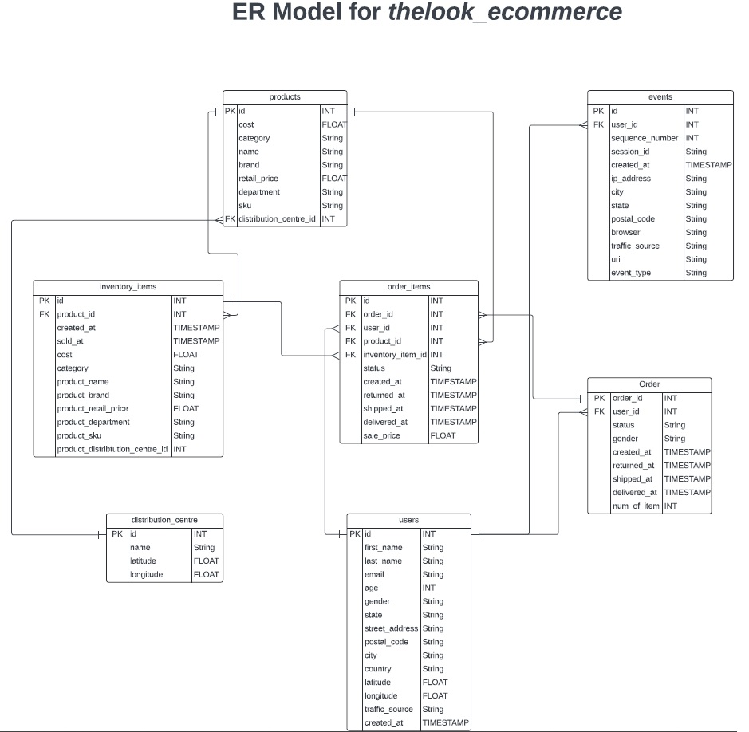
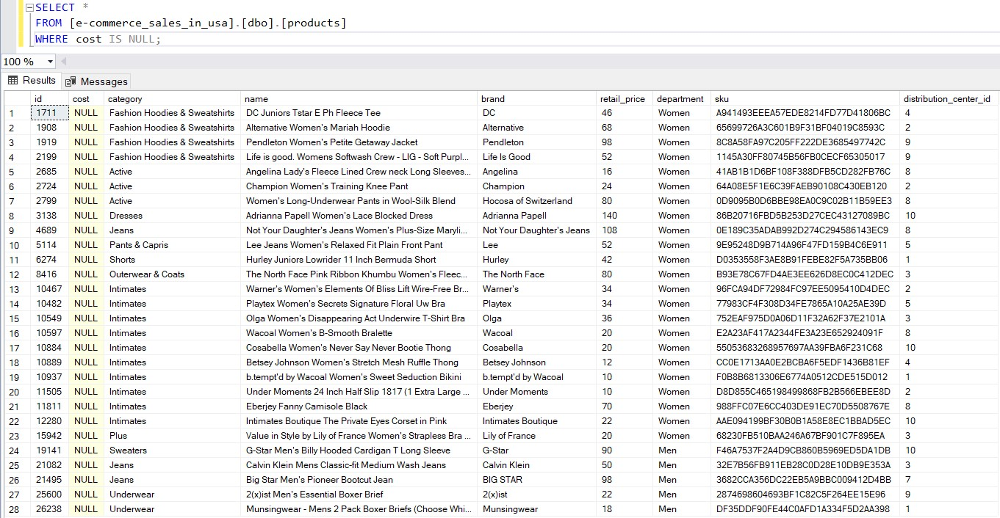
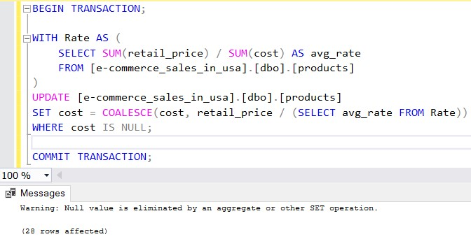
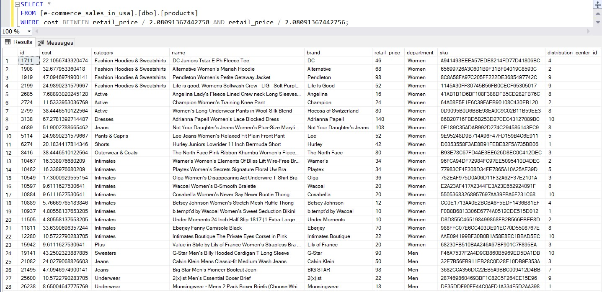

[](https://www.kaggle.com/code/chiraggivan82/thelook-ecommerce)
![Power BI Badge](https://img.shields.io/badge/Power%20BI-2.138-yellow?logo=data:image/svg+xml;base64,PHN2ZyBmaWxsPSJub25lIiB4bWxucz0iaHR0cDovL3d3dy53My5vcmcvMjAwMC9zdmciIHZpZXdCb3g9IjAgMCAxNjAwIDE2MDAiPjxtYXNrIGlkPSJwcmVmaXhfX2EiIHN0eWxlPSJtYXNrLXR5cGU6YWxwaGEiIG1hc2tVbml0cz0idXNlclNwYWNlT25Vc2UiIHg9IjIwMCIgeT0iMCIgd2lkdGg9IjEyMDAiIGhlaWdodD0iMTYwMCI+PHBhdGggZD0iTTEzMzMuMjUgMGMzNi44NiAwIDY2Ljc1IDI5Ljg4NSA2Ni43NSA2Ni43NXYxNDY2LjVjMCAzNi44Ni0yOS44OSA2Ni43NS02Ni43NSA2Ni43NUgyNjYuNjY3Yy0zNi44MTkgMC02Ni42NjctMjkuODUtNjYuNjY3LTY2LjY3Vjg2Ni42NjdDMjAwIDgyOS44NDggMjI5Ljg0OCA4MDAgMjY2LjY2NyA4MDBINTI1VjQ2Ni42NjdDNTI1IDQyOS44NDggNTU0Ljg0OCA0MDAgNTkxLjY2NyA0MDBIODUwVjY2Ljc1Qzg1MCAyOS44ODUgODc5Ljg4NSAwIDkxNi43NSAwaDQxNi41eiIgZmlsbD0iI2ZmZiIvPjwvbWFzaz48ZyBtYXNrPSJ1cmwoI3ByZWZpeF9fYSkiPjxwYXRoIGQ9Ik0xNDAwIDY2Ljc1djE0NjYuNWMwIDM2Ljg2LTI5Ljg5IDY2Ljc1LTY2Ljc1IDY2Ljc1aC00MTYuNWMtMzYuODY1IDAtNjYuNzUtMjkuODktNjYuNzUtNjYuNzVWNjYuNzVDODUwIDI5Ljg4NSA4NzkuODg1IDAgOTE2Ljc1IDBoNDE2LjVjMzYuODcgMCA2Ni43NSAyOS44ODUgNjYuNzUgNjYuNzV6IiBmaWxsPSJ1cmwoI3ByZWZpeF9fcGFpbnQwX2xpbmVhcl84NTkyOjU2MTk4KSIvPjxnIGZpbHRlcj0idXJsKCNwcmVmaXhfX2ZpbHRlcjBfZGRfODU5Mjo1NjE5OCkiPjxwYXRoIGQ9Ik0xMDc1IDQ2Ni42NjdWMTYwMEg1MjVWNDY2LjY2N0M1MjUgNDI5Ljg0OCA1NTQuODQ4IDQwMCA1OTEuNjY3IDQwMGg0MTYuNjYzYzM2LjgyIDAgNjYuNjcgMjkuODQ4IDY2LjY3IDY2LjY2N3oiIGZpbGw9InVybCgjcHJlZml4X19wYWludDFfbGluZWFyXzg1OTI6NTYxOTgpIi8+PC9nPjxwYXRoIGQ9Ik0yMDAgODY2LjY2N3Y2NjYuNjYzYzAgMzYuODIgMjkuODQ4IDY2LjY3IDY2LjY2NyA2Ni42N0g3NTBWODY2LjY2N0M3NTAgODI5Ljg0OCA3MjAuMTUyIDgwMCA2ODMuMzMzIDgwMEgyNjYuNjY3QzIyOS44NDggODAwIDIwMCA4MjkuODQ4IDIwMCA4NjYuNjY3eiIgZmlsbD0idXJsKCNwcmVmaXhfX3BhaW50Ml9saW5lYXJfODU5Mjo1NjE5OCkiLz48L2c+PGRlZnM+PGxpbmVhckdyYWRpZW50IGlkPSJwcmVmaXhfX3BhaW50MF9saW5lYXJfODU5Mjo1NjE5OCIgeDE9Ijc1OC4zMzMiIHkxPSIwIiB4Mj0iMTQ0Ny44MiIgeTI9IjE1MDcuMTUiIGdyYWRpZW50VW5pdHM9InVzZXJTcGFjZU9uVXNlIj48c3RvcCBzdG9wLWNvbG9yPSIjRTZBRDEwIi8+PHN0b3Agb2Zmc2V0PSIxIiBzdG9wLWNvbG9yPSIjQzg3RTBFIi8+PC9saW5lYXJHcmFkaWVudD48bGluZWFyR3JhZGllbnQgaWQ9InByZWZpeF9fcGFpbnQxX2xpbmVhcl84NTkyOjU2MTk4IiB4MT0iNTI0Ljk1NSIgeTE9IjQwMCIgeDI9IjExMDUuNzkiIHkyPSIxNTYxLjY3IiBncmFkaWVudFVuaXRzPSJ1c2VyU3BhY2VPblVzZSI+PHN0b3Agc3RvcC1jb2xvcj0iI0Y2RDc1MSIvPjxzdG9wIG9mZnNldD0iMSIgc3RvcC1jb2xvcj0iI0U2QUQxMCIvPjwvbGluZWFyR3JhZGllbnQ+PGxpbmVhckdyYWRpZW50IGlkPSJwcmVmaXhfX3BhaW50Ml9saW5lYXJfODU5Mjo1NjE5OCIgeDE9IjE5OS45NTUiIHkxPSI4MDAiIHgyPSI1MTkuNzg0IiB5Mj0iMTU4MS42OCIgZ3JhZGllbnRVbml0cz0idXNlclNwYWNlT25Vc2UiPjxzdG9wIHN0b3AtY29sb3I9IiNGOUU1ODkiLz48c3RvcCBvZmZzZXQ9IjEiIHN0b3AtY29sb3I9IiNGNkQ3NTEiLz48L2xpbmVhckdyYWRpZW50PjxmaWx0ZXIgaWQ9InByZWZpeF9fZmlsdGVyMF9kZF84NTkyOjU2MTk4IiB4PSIzOTEuNjY3IiB5PSIzMDAiIHdpZHRoPSI4MTYuNjY3IiBoZWlnaHQ9IjE0NjYuNjciIGZpbHRlclVuaXRzPSJ1c2VyU3BhY2VPblVzZSIgY29sb3ItaW50ZXJwb2xhdGlvbi1maWx0ZXJzPSJzUkdCIj48ZmVGbG9vZCBmbG9vZC1vcGFjaXR5PSIwIiByZXN1bHQ9IkJhY2tncm91bmRJbWFnZUZpeCIvPjxmZUNvbG9yTWF0cml4IGluPSJTb3VyY2VBbHBoYSIgdmFsdWVzPSIwIDAgMCAwIDAgMCAwIDAgMCAwIDAgMCAwIDAgMCAwIDAgMCAxMjcgMCIgcmVzdWx0PSJoYXJkQWxwaGEiLz48ZmVPZmZzZXQgZHk9IjYuMzMzIi8+PGZlR2F1c3NpYW5CbHVyIHN0ZERldmlhdGlvbj0iNi4zMzMiLz48ZmVDb2xvck1hdHJpeCB2YWx1ZXM9IjAgMCAwIDAgMCAwIDAgMCAwIDAgMCAwIDAgMCAwIDAgMCAwIDAuMiAwIi8+PGZlQmxlbmQgaW4yPSJCYWNrZ3JvdW5kSW1hZ2VGaXgiIHJlc3VsdD0iZWZmZWN0MV9kcm9wU2hhZG93Xzg1OTI6NTYxOTgiLz48ZmVDb2xvck1hdHJpeCBpbj0iU291cmNlQWxwaGEiIHZhbHVlcz0iMCAwIDAgMCAwIDAgMCAwIDAgMCAwIDAgMCAwIDAgMCAwIDAgMTI3IDAiIHJlc3VsdD0iaGFyZEFscGhhIi8+PGZlT2Zmc2V0IGR5PSIzMy4zMzMiLz48ZmVHYXVzc2lhbkJsdXIgc3RkRGV2aWF0aW9uPSI2Ni42NjciLz48ZmVDb2xvck1hdHJpeCB2YWx1ZXM9IjAgMCAwIDAgMCAwIDAgMCAwIDAgMCAwIDAgMCAwIDAgMCAwIDAuMTggMCIvPjxmZUJsZW5kIGluMj0iZWZmZWN0MV9kcm9wU2hhZG93Xzg1OTI6NTYxOTgiIHJlc3VsdD0iZWZmZWN0Ml9kcm9wU2hhZG93Xzg1OTI6NTYxOTgiLz48ZmVCbGVuZCBpbj0iU291cmNlR3JhcGhpYyIgaW4yPSJlZmZlY3QyX2Ryb3BTaGFkb3dfODU5Mjo1NjE5OCIgcmVzdWx0PSJzaGFwZSIvPjwvZmlsdGVyPjwvZGVmcz48L3N2Zz4=)
[![SQL](https://img.shields.io/badge/SQL-2022-orange?logo=data:image/svg+xml;base64,PHN2ZyB4bWxucz0iaHR0cDovL3d3dy53My5vcmcvMjAwMC9zdmciIHhtbG5zOnhsaW5rPSJodHRwOi8vd3d3LnczLm9yZy8xOTk5L3hsaW5rIiB2aWV3Qm94PSIwIDAgNjEgODEiIGZpbGw9IiNmZmYiIGZpbGwtcnVsZT0iZXZlbm9kZCIgc3Ryb2tlPSIjMDAwIiBzdHJva2UtbGluZWNhcD0icm91bmQiIHN0cm9rZS1saW5lam9pbj0icm91bmQiPjx1c2UgeGxpbms6aHJlZj0iI0EiIHg9Ii41IiB5PSIuNSIvPjxzeW1ib2wgaWQ9IkEiIG92ZXJmbG93PSJ2aXNpYmxlIj48ZyBmaWxsPSIjMDA3MmM2IiBzdHJva2U9Im5vbmUiPjxwYXRoIGQ9Ik0wIDEwLjkyOXY1OC4xNEMwIDc1LjEwNiAxMy40MzIgODAgMzAgODBWMTAuOTI5SDB6Ii8+PHVzZSB4bGluazpocmVmPSIjQyIvPjwvZz48dXNlIHhsaW5rOmhyZWY9IiNDIiBvcGFjaXR5PSIuMTUiIHN0cm9rZT0ibm9uZSIvPjxwYXRoIGQ9Ik02MCAxMC45MjljMCA2LjAzNi0xMy40MzIgMTAuOTI5LTMwIDEwLjkyOVMwIDE2Ljk2NSAwIDEwLjkyOSAxMy40MzIgMCAzMCAwczMwIDQuODkzIDMwIDEwLjkyOSIgc3Ryb2tlPSJub25lIi8+PHBhdGggZD0iTTUzLjg2NiAxMC4yOTljMCAzLjk4NS0xMC42ODUgNy4yMTEtMjMuODY2IDcuMjExUzYuMTMyIDE0LjI4NCA2LjEzMiAxMC4yOTkgMTYuODE5IDMuMDg4IDMwIDMuMDg4czIzLjg2NiAzLjIyOCAyMy44NjYgNy4yMTEiIGZpbGw9IiM3ZmJhMDAiIHN0cm9rZT0ibm9uZSIvPjxwYXRoIGQ9Ik00OC44NjcgMTQuNzA3YzMuMTI0LTEuMjE5IDUuMDAyLTIuNzQ1IDUuMDAyLTQuNDA0QzUzLjg2OCA2LjMxOCA0My4xODMgMy4wOSAzMCAzLjA5UzYuMTM0IDYuMzE4IDYuMTM0IDEwLjMwM2MwIDEuNjU4IDEuODc3IDMuMTg1IDUuMDAyIDQuNDA0IDQuMzYzLTEuNzA0IDExLjE4Mi0yLjgwMyAxOC44NjUtMi44MDNzMTQuNSAxLjA5OSAxOC44NjYgMi44MDMiIGZpbGw9IiNiOGQ0MzIiIHN0cm9rZT0ibm9uZSIvPjxwYXRoIGQ9Ik0yMC40NzIgNTEuMjg3YzAgMS44MDctLjY1MSAzLjIwNi0xLjk1NSA0LjE5N3MtMy4xMDIgMS40ODgtNS4zOTkgMS40ODhjLTEuOTU0IDAtMy41ODctLjM1NC00Ljg5OS0xLjA2M3YtNC4yNTFjMS41MTQgMS4yOTMgMy4xODIgMS45NCA1LjAwNCAxLjk0Ljg4IDAgMS41NjEtLjE3NyAyLjA0MS0uNTMycy43Mi0uODIzLjcyLTEuNDA5YzAtLjU3NS0uMjMxLTEuMDc1LS42OTMtMS41cy0xLjQwMi0uOTc0LTIuODE5LTEuNjQ3Yy0yLjg4OC0xLjM2Mi00LjMzMS0zLjIyNC00LjMzMS01LjU3NyAwLTEuNzA4LjYyOS0zLjA3OCAxLjg4OS00LjExczIuOTMxLTEuNTQ3IDUuMDE2LTEuNTQ3YzEuODQ5IDAgMy4zNzkuMjQ1IDQuNTk2LjczMXYzLjk3MWMtMS4yNzYtLjg4Ni0yLjcyOS0xLjMyOC00LjM1Ny0xLjMyOC0uODE4IDAtMS40NjUuMTc0LTEuOTQuNTIzYTEuNjUgMS42NSAwIDAgMC0uNzEyIDEuNDAxYzAgLjYwMi4xOTEgMS4wOTYuNTc1IDEuNDgxczEuMTY4Ljg2MSAyLjM1NiAxLjQyOGMxLjc3Ljg0MiAzLjAzIDEuNjk1IDMuNzg0IDIuNTYzczEuMTI1IDEuOTUgMS4xMjUgMy4yNDF6bTIwLjM3LTQuMzAyYzAgMi4yNC0uNTA3IDQuMTg1LTEuNTE5IDUuODNzLTIuNDM4IDIuODAxLTQuMjc3IDMuNDY2bDUuNDkxIDUuMTEzaC01LjU0NGwtMy45MjEtNC40MjNjLTEuNjgxLS4wNjEtMy4xOTgtLjUwOS00LjU0OS0xLjM0MXMtMi4zOTUtMS45NzItMy4xMjktMy40Mi0xLjEwMy0zLjA2Mi0xLjEwMy00Ljg0MWMwLTEuOTc0LjM5OC0zLjczNCAxLjE5NC01LjI3OXMxLjkxNi0yLjczNCAzLjM2LTMuNTY2IDMuMDk3LTEuMjQ4IDQuOTY1LTEuMjQ4YzEuNzQxIDAgMy4zMDIuNDAzIDQuNjggMS4yMDlzMi40NDYgMS45NTEgMy4yMDggMy40MzkgMS4xNDQgMy4xNzUgMS4xNDQgNS4wNnptLTQuNDg4LjI0YzAtMS45MzEtLjQxOC0zLjQ1NS0xLjI1NS00LjU3NnMtMS45OC0xLjY4MS0zLjQzMy0xLjY4MWMtMS40NzkgMC0yLjY2Mi41NjItMy41NTIgMS42ODVzLTEuMzMzIDIuNjIxLTEuMzMzIDQuNDg5YzAgMS44Ni40MzUgMy4zNDQgMS4zMDYgNC40NTVzMi4wMjggMS42NjYgMy40NzIgMS42NjZjMS40NzEgMCAyLjYzNi0uNTM4IDMuNDk5LTEuNjEzczEuMjk2LTIuNTUgMS4yOTYtNC40MjZ6bTE4Ljg5MyA5LjQxNEg0My45NzJWMzcuNTk2aDQuMjY0VjUzLjE2aDcuMDF6IiBzdHJva2U9Im5vbmUiLz48L3N5bWJvbD48ZGVmcyA+PHBhdGggaWQ9IkMiIGQ9Ik0yOS41ODkgNzkuOTk5SDMwYzE2LjU2OCAwIDMwLTQuODkyIDMwLTEwLjkyOXYtNTguMTRIMjkuNTg5djY5LjA3eiIvPjwvZGVmcz48L3N2Zz4=)](https://www.microsoft.com/en-us/sql-server)
[](https://community.fabric.microsoft.com/t5/Data-Stories-Gallery/Sales-Performance/td-p/4359641)
[](https://github.com/EugeneGrod/e-commerce-sales-in-usa)

# E-Commerce Analytics Across the USA

## Authors

- [@EugeneGrod](https://github.com/EugeneGrod)

## Table of Contents

## Business Problem

Optimize e-commerce sales performance across USA regions

## Data Source

- [Kaggle The eCommerce Business Analysis](https://www.kaggle.com/code/chiraggivan82/thelook-ecommerce)

## Data Base Schema

*Add foreign keys to the database schema*

```sql
BEGIN TRANSACTION;

ALTER TABLE [products]
ADD CONSTRAINT FK_products_distribution_centers
FOREIGN KEY ([distribution_center_id]) REFERENCES [distribution_centers]([id]);

ALTER TABLE [inventory_items]
ADD CONSTRAINT FK_inventory_items_products
FOREIGN KEY ([product_id]) REFERENCES [products]([id]);

ALTER TABLE [order_items]
ADD
    CONSTRAINT FK_order_items_orders
    FOREIGN KEY ([order_id]) REFERENCES [orders]([id]),
    CONSTRAINT FK_order_items_users
    FOREIGN KEY ([user_id]) REFERENCES [users]([id]),
    CONSTRAINT FK_order_items_products
    FOREIGN KEY ([product_id]) REFERENCES [products]([id]),
    CONSTRAINT FK_order_items_inventory_items
    FOREIGN KEY ([inventory_item_id]) REFERENCES [inventory_items]([id]);

ALTER TABLE [events]
ADD CONSTRAINT FK_events_users
FOREIGN KEY ([user_id]) REFERENCES [users]([id]);

ALTER TABLE [orders]
ADD CONSTRAINT FK_orders_users
FOREIGN KEY ([user_id]) REFERENCES [users]([id]);

COMMIT TRANSACTION;
```



## Data Cleaning

### SQL Server

- ***distribution_centers:***

      Clean table

- ***products:***

	- **"cost" column**
    		
		1. *NULL values*
		
		Replace `NULL` values with the average ratio between retail and cost prices  

		```sql
		WITH [Rate] AS (
       			SELECT SUM([retail_price]) / SUM([cost]) AS [avg_rate]
			FROM [e-commerce_sales_in_usa].[dbo].[products]
   		)
   		
		UPDATE [e-commerce_sales_in_usa].[dbo].[products]
   		SET [cost] = COALESCE([cost], [retail_price] / (SELECT [avg_rate] FROM [Rate]))
   		WHERE [cost] IS NULL;
		```

		

		

		

#### 'products' Table Summary

| Column Name                      | NULL's      | Duplicates    | Negative Quantities | Invalid Data Types | Invalid Formats | Foreign Key Violations | Outliers | Missing References | Inconsistent Units or Measures | Missing or Inconsistent Timestamps | Inconsistent Status Codes |
|:---------------------------------|:-----------:|:-------------:|:-------------------:|:------------------:|:---------------:|:----------------------:|:--------:|:------------------:|:------------------------------:|:----------------------------------:|:-------------------------:|
| id                               | ⬜           | ⬜             | ⬜                   | ⬜                 | ⬜               | ⬜                      |⬜         | ⬜                  | ⬜                             | ⬜                                  | ⬜                         |
| cost                             | ✔          | ⬜             | ⬜                   | ⬜                 | ⬜               | ⬜                      |⬜         | ⬜                  | ⬜                             | ⬜                                  | ⬜                         |
| category                         | ⬜           | ⬜             | ⬜                   | ⬜                 | ⬜               | ⬜                      |⬜         | ⬜                  | ⬜                             | ⬜                                  | ⬜                         |
| name                             | ⬜           | ⬜             | ⬜                   | ⬜                 | ⬜               | ⬜                      |⬜         | ⬜                  | ⬜                             | ⬜                                  | ⬜                         |
| brand                            | ⬜           | ⬜             | ⬜                   | ⬜                 | ⬜               | ⬜                      |⬜         | ⬜                  | ⬜                             | ⬜                                  | ⬜                         |
| retail_price                     | ⬜           | ⬜             | ⬜                   | ⬜                 | ⬜               | ⬜                      |⬜         | ⬜                  | ⬜                             | ⬜                                  | ⬜                         |
| department                       | ⬜           | ⬜             | ⬜                   | ⬜                 | ⬜               | ⬜                      |⬜         | ⬜                  | ⬜                             | ⬜                                  | ⬜                         |
| sku                              | ⬜           | ⬜             | ⬜                   | ⬜                 | ⬜               | ⬜                      |⬜         | ⬜                  | ⬜                             | ⬜                                  | ⬜                         |
| distribution_center_id           | ⬜           | ⬜             | ⬜                   | ⬜                 | ⬜               | ⬜                      |⬜         | ⬜                  | ⬜                             | ⬜                                  | ⬜                         |

- ***orders and order_items:***
	               
      Clean table
- ***users:***

      Clean table
- ***inventory_items:***

      Clean table
- ***events:***

### Data Cleaning Summary

| Table Name                       | NULL's      | Duplicates    | Negative Quantities | Invalid Data Types | Invalid Formats | Foreign Key Violations | Outliers | Missing References | Inconsistent Units or Measures | Missing or Inconsistent Timestamps | Inconsistent Status Codes |
|:---------------------------------|:-----------:|:-------------:|:-------------------:|:------------------:|:---------------:|:----------------------:|:--------:|:------------------:|:------------------------------:|:----------------------------------:|:-------------------------:|
| distribution_centers             | ⬜           | ⬜             | ⬜                   | ⬜                 | ⬜               | ⬜                      |⬜         | ⬜                  | ⬜                             | ⬜                                  | ⬜                         |
| events                           | ⬜           | ⬜             | ⬜                   | ⬜                 | ⬜               | ⬜                      |⬜         | ⬜                  | ⬜                             | ⬜                                  | ⬜                         |
| inventory_items                  | ⬜           | ⬜             | ⬜                   | ⬜                 | ⬜               | ⬜                      |⬜         | ⬜                  | ⬜                             | ⬜                                  | ⬜                         |
| order_items                      | ⬜           | ⬜             | ⬜                   | ⬜                 | ⬜               | ⬜                      |⬜         | ⬜                  | ⬜                             | ⬜                                  | ⬜                         |
| orders                           | ⬜           | ⬜             | ⬜                   | ⬜                 | ⬜               | ⬜                      |⬜         | ⬜                  | ⬜                             | ⬜                                  | ⬜                         |
| products                         | ⬜           | ⬜             | ⬜                   | ⬜                 | ⬜               | ⬜                      |⬜         | ⬜                  | ⬜                             | ⬜                                  | ⬜                         |
| start_to_end_purchase_events     | ⬜           | ⬜             | ⬜                   | ⬜                 | ⬜               | ⬜                      |⬜         | ⬜                  | ⬜                             | ⬜                                  | ⬜                         |
| users                            | ⬜           | ⬜             | ⬜                   | ⬜                 | ⬜               | ⬜                      |⬜         | ⬜                  | ⬜                             | ⬜                                  | ⬜                         |
