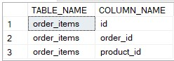
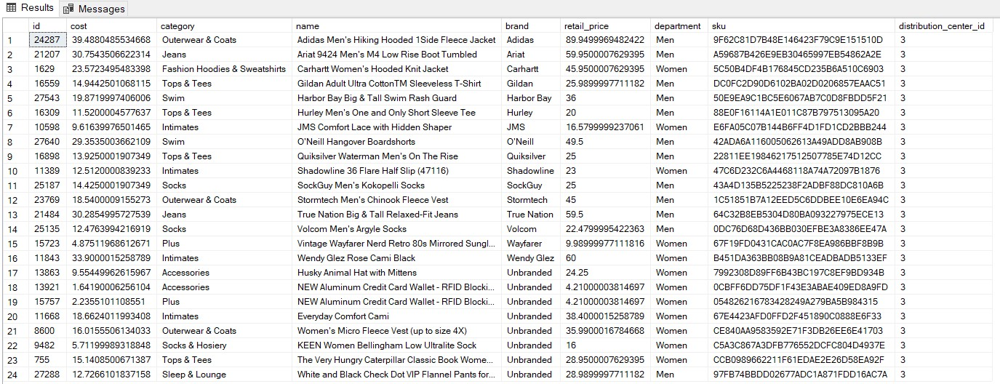

<h1 align="center">E-Commerce Analytics Across the USA</h1>

[](https://www.kaggle.com/code/chiraggivan82/thelook-ecommerce)
<br>
![Power BI Badge](https://img.shields.io/badge/Power%20BI-2.138-yellow?logo=data:image/svg+xml;base64,PHN2ZyBmaWxsPSJub25lIiB4bWxucz0iaHR0cDovL3d3dy53My5vcmcvMjAwMC9zdmciIHZpZXdCb3g9IjAgMCAxNjAwIDE2MDAiPjxtYXNrIGlkPSJwcmVmaXhfX2EiIHN0eWxlPSJtYXNrLXR5cGU6YWxwaGEiIG1hc2tVbml0cz0idXNlclNwYWNlT25Vc2UiIHg9IjIwMCIgeT0iMCIgd2lkdGg9IjEyMDAiIGhlaWdodD0iMTYwMCI+PHBhdGggZD0iTTEzMzMuMjUgMGMzNi44NiAwIDY2Ljc1IDI5Ljg4NSA2Ni43NSA2Ni43NXYxNDY2LjVjMCAzNi44Ni0yOS44OSA2Ni43NS02Ni43NSA2Ni43NUgyNjYuNjY3Yy0zNi44MTkgMC02Ni42NjctMjkuODUtNjYuNjY3LTY2LjY3Vjg2Ni42NjdDMjAwIDgyOS44NDggMjI5Ljg0OCA4MDAgMjY2LjY2NyA4MDBINTI1VjQ2Ni42NjdDNTI1IDQyOS44NDggNTU0Ljg0OCA0MDAgNTkxLjY2NyA0MDBIODUwVjY2Ljc1Qzg1MCAyOS44ODUgODc5Ljg4NSAwIDkxNi43NSAwaDQxNi41eiIgZmlsbD0iI2ZmZiIvPjwvbWFzaz48ZyBtYXNrPSJ1cmwoI3ByZWZpeF9fYSkiPjxwYXRoIGQ9Ik0xNDAwIDY2Ljc1djE0NjYuNWMwIDM2Ljg2LTI5Ljg5IDY2Ljc1LTY2Ljc1IDY2Ljc1aC00MTYuNWMtMzYuODY1IDAtNjYuNzUtMjkuODktNjYuNzUtNjYuNzVWNjYuNzVDODUwIDI5Ljg4NSA4NzkuODg1IDAgOTE2Ljc1IDBoNDE2LjVjMzYuODcgMCA2Ni43NSAyOS44ODUgNjYuNzUgNjYuNzV6IiBmaWxsPSJ1cmwoI3ByZWZpeF9fcGFpbnQwX2xpbmVhcl84NTkyOjU2MTk4KSIvPjxnIGZpbHRlcj0idXJsKCNwcmVmaXhfX2ZpbHRlcjBfZGRfODU5Mjo1NjE5OCkiPjxwYXRoIGQ9Ik0xMDc1IDQ2Ni42NjdWMTYwMEg1MjVWNDY2LjY2N0M1MjUgNDI5Ljg0OCA1NTQuODQ4IDQwMCA1OTEuNjY3IDQwMGg0MTYuNjYzYzM2LjgyIDAgNjYuNjcgMjkuODQ4IDY2LjY3IDY2LjY2N3oiIGZpbGw9InVybCgjcHJlZml4X19wYWludDFfbGluZWFyXzg1OTI6NTYxOTgpIi8+PC9nPjxwYXRoIGQ9Ik0yMDAgODY2LjY2N3Y2NjYuNjYzYzAgMzYuODIgMjkuODQ4IDY2LjY3IDY2LjY2NyA2Ni42N0g3NTBWODY2LjY2N0M3NTAgODI5Ljg0OCA3MjAuMTUyIDgwMCA2ODMuMzMzIDgwMEgyNjYuNjY3QzIyOS44NDggODAwIDIwMCA4MjkuODQ4IDIwMCA4NjYuNjY3eiIgZmlsbD0idXJsKCNwcmVmaXhfX3BhaW50Ml9saW5lYXJfODU5Mjo1NjE5OCkiLz48L2c+PGRlZnM+PGxpbmVhckdyYWRpZW50IGlkPSJwcmVmaXhfX3BhaW50MF9saW5lYXJfODU5Mjo1NjE5OCIgeDE9Ijc1OC4zMzMiIHkxPSIwIiB4Mj0iMTQ0Ny44MiIgeTI9IjE1MDcuMTUiIGdyYWRpZW50VW5pdHM9InVzZXJTcGFjZU9uVXNlIj48c3RvcCBzdG9wLWNvbG9yPSIjRTZBRDEwIi8+PHN0b3Agb2Zmc2V0PSIxIiBzdG9wLWNvbG9yPSIjQzg3RTBFIi8+PC9saW5lYXJHcmFkaWVudD48bGluZWFyR3JhZGllbnQgaWQ9InByZWZpeF9fcGFpbnQxX2xpbmVhcl84NTkyOjU2MTk4IiB4MT0iNTI0Ljk1NSIgeTE9IjQwMCIgeDI9IjExMDUuNzkiIHkyPSIxNTYxLjY3IiBncmFkaWVudFVuaXRzPSJ1c2VyU3BhY2VPblVzZSI+PHN0b3Agc3RvcC1jb2xvcj0iI0Y2RDc1MSIvPjxzdG9wIG9mZnNldD0iMSIgc3RvcC1jb2xvcj0iI0U2QUQxMCIvPjwvbGluZWFyR3JhZGllbnQ+PGxpbmVhckdyYWRpZW50IGlkPSJwcmVmaXhfX3BhaW50Ml9saW5lYXJfODU5Mjo1NjE5OCIgeDE9IjE5OS45NTUiIHkxPSI4MDAiIHgyPSI1MTkuNzg0IiB5Mj0iMTU4MS42OCIgZ3JhZGllbnRVbml0cz0idXNlclNwYWNlT25Vc2UiPjxzdG9wIHN0b3AtY29sb3I9IiNGOUU1ODkiLz48c3RvcCBvZmZzZXQ9IjEiIHN0b3AtY29sb3I9IiNGNkQ3NTEiLz48L2xpbmVhckdyYWRpZW50PjxmaWx0ZXIgaWQ9InByZWZpeF9fZmlsdGVyMF9kZF84NTkyOjU2MTk4IiB4PSIzOTEuNjY3IiB5PSIzMDAiIHdpZHRoPSI4MTYuNjY3IiBoZWlnaHQ9IjE0NjYuNjciIGZpbHRlclVuaXRzPSJ1c2VyU3BhY2VPblVzZSIgY29sb3ItaW50ZXJwb2xhdGlvbi1maWx0ZXJzPSJzUkdCIj48ZmVGbG9vZCBmbG9vZC1vcGFjaXR5PSIwIiByZXN1bHQ9IkJhY2tncm91bmRJbWFnZUZpeCIvPjxmZUNvbG9yTWF0cml4IGluPSJTb3VyY2VBbHBoYSIgdmFsdWVzPSIwIDAgMCAwIDAgMCAwIDAgMCAwIDAgMCAwIDAgMCAwIDAgMCAxMjcgMCIgcmVzdWx0PSJoYXJkQWxwaGEiLz48ZmVPZmZzZXQgZHk9IjYuMzMzIi8+PGZlR2F1c3NpYW5CbHVyIHN0ZERldmlhdGlvbj0iNi4zMzMiLz48ZmVDb2xvck1hdHJpeCB2YWx1ZXM9IjAgMCAwIDAgMCAwIDAgMCAwIDAgMCAwIDAgMCAwIDAgMCAwIDAuMiAwIi8+PGZlQmxlbmQgaW4yPSJCYWNrZ3JvdW5kSW1hZ2VGaXgiIHJlc3VsdD0iZWZmZWN0MV9kcm9wU2hhZG93Xzg1OTI6NTYxOTgiLz48ZmVDb2xvck1hdHJpeCBpbj0iU291cmNlQWxwaGEiIHZhbHVlcz0iMCAwIDAgMCAwIDAgMCAwIDAgMCAwIDAgMCAwIDAgMCAwIDAgMTI3IDAiIHJlc3VsdD0iaGFyZEFscGhhIi8+PGZlT2Zmc2V0IGR5PSIzMy4zMzMiLz48ZmVHYXVzc2lhbkJsdXIgc3RkRGV2aWF0aW9uPSI2Ni42NjciLz48ZmVDb2xvck1hdHJpeCB2YWx1ZXM9IjAgMCAwIDAgMCAwIDAgMCAwIDAgMCAwIDAgMCAwIDAgMCAwIDAuMTggMCIvPjxmZUJsZW5kIGluMj0iZWZmZWN0MV9kcm9wU2hhZG93Xzg1OTI6NTYxOTgiIHJlc3VsdD0iZWZmZWN0Ml9kcm9wU2hhZG93Xzg1OTI6NTYxOTgiLz48ZmVCbGVuZCBpbj0iU291cmNlR3JhcGhpYyIgaW4yPSJlZmZlY3QyX2Ryb3BTaGFkb3dfODU5Mjo1NjE5OCIgcmVzdWx0PSJzaGFwZSIvPjwvZmlsdGVyPjwvZGVmcz48L3N2Zz4=)
<br>
[![SQL](https://img.shields.io/badge/SQL-2022-orange?logo=data:image/svg+xml;base64,PHN2ZyB4bWxucz0iaHR0cDovL3d3dy53My5vcmcvMjAwMC9zdmciIHhtbG5zOnhsaW5rPSJodHRwOi8vd3d3LnczLm9yZy8xOTk5L3hsaW5rIiB2aWV3Qm94PSIwIDAgNjEgODEiIGZpbGw9IiNmZmYiIGZpbGwtcnVsZT0iZXZlbm9kZCIgc3Ryb2tlPSIjMDAwIiBzdHJva2UtbGluZWNhcD0icm91bmQiIHN0cm9rZS1saW5lam9pbj0icm91bmQiPjx1c2UgeGxpbms6aHJlZj0iI0EiIHg9Ii41IiB5PSIuNSIvPjxzeW1ib2wgaWQ9IkEiIG92ZXJmbG93PSJ2aXNpYmxlIj48ZyBmaWxsPSIjMDA3MmM2IiBzdHJva2U9Im5vbmUiPjxwYXRoIGQ9Ik0wIDEwLjkyOXY1OC4xNEMwIDc1LjEwNiAxMy40MzIgODAgMzAgODBWMTAuOTI5SDB6Ii8+PHVzZSB4bGluazpocmVmPSIjQyIvPjwvZz48dXNlIHhsaW5rOmhyZWY9IiNDIiBvcGFjaXR5PSIuMTUiIHN0cm9rZT0ibm9uZSIvPjxwYXRoIGQ9Ik02MCAxMC45MjljMCA2LjAzNi0xMy40MzIgMTAuOTI5LTMwIDEwLjkyOVMwIDE2Ljk2NSAwIDEwLjkyOSAxMy40MzIgMCAzMCAwczMwIDQuODkzIDMwIDEwLjkyOSIgc3Ryb2tlPSJub25lIi8+PHBhdGggZD0iTTUzLjg2NiAxMC4yOTljMCAzLjk4NS0xMC42ODUgNy4yMTEtMjMuODY2IDcuMjExUzYuMTMyIDE0LjI4NCA2LjEzMiAxMC4yOTkgMTYuODE5IDMuMDg4IDMwIDMuMDg4czIzLjg2NiAzLjIyOCAyMy44NjYgNy4yMTEiIGZpbGw9IiM3ZmJhMDAiIHN0cm9rZT0ibm9uZSIvPjxwYXRoIGQ9Ik00OC44NjcgMTQuNzA3YzMuMTI0LTEuMjE5IDUuMDAyLTIuNzQ1IDUuMDAyLTQuNDA0QzUzLjg2OCA2LjMxOCA0My4xODMgMy4wOSAzMCAzLjA5UzYuMTM0IDYuMzE4IDYuMTM0IDEwLjMwM2MwIDEuNjU4IDEuODc3IDMuMTg1IDUuMDAyIDQuNDA0IDQuMzYzLTEuNzA0IDExLjE4Mi0yLjgwMyAxOC44NjUtMi44MDNzMTQuNSAxLjA5OSAxOC44NjYgMi44MDMiIGZpbGw9IiNiOGQ0MzIiIHN0cm9rZT0ibm9uZSIvPjxwYXRoIGQ9Ik0yMC40NzIgNTEuMjg3YzAgMS44MDctLjY1MSAzLjIwNi0xLjk1NSA0LjE5N3MtMy4xMDIgMS40ODgtNS4zOTkgMS40ODhjLTEuOTU0IDAtMy41ODctLjM1NC00Ljg5OS0xLjA2M3YtNC4yNTFjMS41MTQgMS4yOTMgMy4xODIgMS45NCA1LjAwNCAxLjk0Ljg4IDAgMS41NjEtLjE3NyAyLjA0MS0uNTMycy43Mi0uODIzLjcyLTEuNDA5YzAtLjU3NS0uMjMxLTEuMDc1LS42OTMtMS41cy0xLjQwMi0uOTc0LTIuODE5LTEuNjQ3Yy0yLjg4OC0xLjM2Mi00LjMzMS0zLjIyNC00LjMzMS01LjU3NyAwLTEuNzA4LjYyOS0zLjA3OCAxLjg4OS00LjExczIuOTMxLTEuNTQ3IDUuMDE2LTEuNTQ3YzEuODQ5IDAgMy4zNzkuMjQ1IDQuNTk2LjczMXYzLjk3MWMtMS4yNzYtLjg4Ni0yLjcyOS0xLjMyOC00LjM1Ny0xLjMyOC0uODE4IDAtMS40NjUuMTc0LTEuOTQuNTIzYTEuNjUgMS42NSAwIDAgMC0uNzEyIDEuNDAxYzAgLjYwMi4xOTEgMS4wOTYuNTc1IDEuNDgxczEuMTY4Ljg2MSAyLjM1NiAxLjQyOGMxLjc3Ljg0MiAzLjAzIDEuNjk1IDMuNzg0IDIuNTYzczEuMTI1IDEuOTUgMS4xMjUgMy4yNDF6bTIwLjM3LTQuMzAyYzAgMi4yNC0uNTA3IDQuMTg1LTEuNTE5IDUuODNzLTIuNDM4IDIuODAxLTQuMjc3IDMuNDY2bDUuNDkxIDUuMTEzaC01LjU0NGwtMy45MjEtNC40MjNjLTEuNjgxLS4wNjEtMy4xOTgtLjUwOS00LjU0OS0xLjM0MXMtMi4zOTUtMS45NzItMy4xMjktMy40Mi0xLjEwMy0zLjA2Mi0xLjEwMy00Ljg0MWMwLTEuOTc0LjM5OC0zLjczNCAxLjE5NC01LjI3OXMxLjkxNi0yLjczNCAzLjM2LTMuNTY2IDMuMDk3LTEuMjQ4IDQuOTY1LTEuMjQ4YzEuNzQxIDAgMy4zMDIuNDAzIDQuNjggMS4yMDlzMi40NDYgMS45NTEgMy4yMDggMy40MzkgMS4xNDQgMy4xNzUgMS4xNDQgNS4wNnptLTQuNDg4LjI0YzAtMS45MzEtLjQxOC0zLjQ1NS0xLjI1NS00LjU3NnMtMS45OC0xLjY4MS0zLjQzMy0xLjY4MWMtMS40NzkgMC0yLjY2Mi41NjItMy41NTIgMS42ODVzLTEuMzMzIDIuNjIxLTEuMzMzIDQuNDg5YzAgMS44Ni40MzUgMy4zNDQgMS4zMDYgNC40NTVzMi4wMjggMS42NjYgMy40NzIgMS42NjZjMS40NzEgMCAyLjYzNi0uNTM4IDMuNDk5LTEuNjEzczEuMjk2LTIuNTUgMS4yOTYtNC40MjZ6bTE4Ljg5MyA5LjQxNEg0My45NzJWMzcuNTk2aDQuMjY0VjUzLjE2aDcuMDF6IiBzdHJva2U9Im5vbmUiLz48L3N5bWJvbD48ZGVmcyA+PHBhdGggaWQ9IkMiIGQ9Ik0yOS41ODkgNzkuOTk5SDMwYzE2LjU2OCAwIDMwLTQuODkyIDMwLTEwLjkyOXYtNTguMTRIMjkuNTg5djY5LjA3eiIvPjwvZGVmcz48L3N2Zz4=)](https://www.microsoft.com/en-us/sql-server)
<br>
[](https://community.fabric.microsoft.com/t5/Data-Stories-Gallery/Sales-Performance/td-p/4359641)
<br>
[](https://github.com/EugeneGrod/e-commerce-sales-in-usa)

<hr>

## Authors

- [@EugeneGrod](https://github.com/EugeneGrod)

## Table of Contents

- [Authros](#authors)
- [Business Problem](#business-problem)
- [Data Source](#data-source)
- [Initial Data Base Schema](#initital_data_base_schema)
- [Data Normalization](#database_normalization)
- [Data Cleaning](#data-cleaning)
- [Data Visualization]

## Business Problem

Optimize e-commerce sales performance across USA regions

## Data Source

- [Kaggle The eCommerce Business Analysis](https://www.kaggle.com/code/chiraggivan82/thelook-ecommerce)

<h2 id="initital_data_base_schema" align="center">Initial Data Base Schema</h2>

*Add foreign keys to the database schema based on its initial structure from the BigQuery resource*

```sql
BEGIN TRANSACTION;

ALTER TABLE [products]
ADD CONSTRAINT FK_products_distribution_centers
FOREIGN KEY ([distribution_center_id]) REFERENCES [distribution_centers]([id]);

ALTER TABLE [inventory_items]
ADD CONSTRAINT FK_inventory_items_products
FOREIGN KEY ([product_id]) REFERENCES [products]([id]);

ALTER TABLE [order_items]
ADD
    CONSTRAINT FK_order_items_orders
    FOREIGN KEY ([order_id]) REFERENCES [orders]([id]),
    CONSTRAINT FK_order_items_users
    FOREIGN KEY ([user_id]) REFERENCES [users]([id]),
    CONSTRAINT FK_order_items_products
    FOREIGN KEY ([product_id]) REFERENCES [products]([id]),
    CONSTRAINT FK_order_items_inventory_items
    FOREIGN KEY ([inventory_item_id]) REFERENCES [inventory_items]([id]);

ALTER TABLE [events]
ADD CONSTRAINT FK_events_users
FOREIGN KEY ([user_id]) REFERENCES [users]([id]);

ALTER TABLE [orders]
ADD CONSTRAINT FK_orders_users
FOREIGN KEY ([user_id]) REFERENCES [users]([id]);

COMMIT TRANSACTION;
```


<h2 id="database_normalization" align="center">Database Normalization</h2>

- ### `inventory_items table:`
    		
	- **3NF Violation:**

		1. <u>*Violation:*</u>
		
		The `inventory_items` table contains <b>transitive functional dependencies</b>, which violate <b>the Third Normal Form (3NF)</b>.

		2. <u>*Affected Attributes:*</u> 

		The following columns <b>are not functionally dependent on the primary key</b> (`id`),
		but instead on the foreign key (`product_id`):
		
		`product_category`
		`product_name`
		`product_brand`
		`product_retail_price`
		`product_department`
		`product_sku`
		`product_distribution_center_id`

		3. <u>*Issues:*</u>
		
		`Redundancy:` Repeating product details in every inventory record.

		`Update Anomaly:` Updating product details requires modifying multiple rows.

		4. <u>*Solution:*</u>
		
		Remove redundant columns and retrieve product details via the `products` table.

	```sql
	SELECT
		product_id,
		cost,
		product_category,
		product_name,
		product_brand,
		product_retail_price,
		product_department,
		product_distribution_center_id
	FROM inventory_items
	WHERE product_id = 7615;

	BEGIN TRANSACTION;
	
	ALTER TABLE inventory_items
	DROP COLUMN
		cost,
		product_category,
		product_name,
		product_brand,
		product_retail_price,
		product_department,
		product_sku,
		product_distribution_center_id;
	
	COMMIT;
	```

	

	

- ### `order_items table:`
    		
	- **3NF Violation:**

		1. <u>*Violation:*</u>
		
		The `order_items` table contains <b>transitive functional dependencies</b>, which violate the <b>Third Normal Form (3NF)</b>.
		Additionally, we have discovered that the values in the `created_at` column are greater than those in `shipped_at` column, which
		could be due to <b>bad system design</b> or data entry errors.
		

		2. <u>*Affected Attributes:*</u> 

		The following columns are <b>not functionally dependent on the primary key</b> (`id`),
		but instead on the foreign key (`order_id`):
		
		`created_at`
		`shipped_at`
		`delivered_at;`
		`returned_at`

		3. <u>*Issues:*</u>
		
		`Redundancy:` Repeating date values (like created_at, shipped_at, etc.) in the order_items table causes <b>data duplication</b>.
		These values are already available in the orders table, making them redundant.

		`Update Anomaly:` Because the same information is stored in both the order_items and orders tables,
		updates to these values must be made in multiple places. If one place is missed, it could lead to <b>inconsistent data</b>.

		4. <u>*Solution:*</u>
		
		Remove redundant columns and retrieve order details via the `orders` table.

	```sql
	SELECT TOP 100
		oi.created_at,
		o.created_at,
		oi.shipped_at,
		o.shipped_at,
		oi.delivered_at,
		o.delivered_at,
		oi.returned_at,
		o.returned_at
	FROM order_items AS oi
	JOIN orders AS o ON o.id = oi.order_id;

	SELECT 

	BEGIN TRANSACTION;

	ALTER TABLE order_items
	DROP COLUMN
		created_at,
		shipped_at,
		delivered_at,
		returned_at;

	COMMIT;

	SELECT TABLE_NAME, COLUMN_NAME
	FROM INFORMATION_SCHEMA.COLUMNS
	WHERE TABLE_NAME LIKE 'order_items';
	```

	

	

	- **More 3NF Violation:**

		The order_items table contains additional <b>transitive functional dependencies</b>.
		The `status` and `user_id` columns are <b>not functionally dependent on the primary key</b> (id), but instead on the foreign keys (`order_id`, `user_id`).
		Since we have a foreign key constraint `FK_order_items_users`, we need to drop the constraint before removing these columns.
		
		```sql
		SELECT TOP 100
			oi.status,
			o.status,
			oi.user_id,
			o.user_id
		FROM order_items AS oi
		JOIN orders AS o ON o.id = oi.order_id;
		```

		
	
		```sql
		SELECT
    			f.name AS ForeignKeyName,
    			OBJECT_NAME(f.parent_object_id) AS TableName,
				COL_NAME(fc.parent_object_id, fc.parent_column_id) AS ColumnName,
    			OBJECT_NAME(f.referenced_object_id) AS ReferencedTable,
    			COL_NAME(fc.referenced_object_id, fc.referenced_column_id) AS ReferencedColumn
		FROM sys.foreign_keys AS f
		JOIN sys.foreign_key_columns AS fc ON f.object_id = fc.constraint_object_id
		WHERE OBJECT_NAME(f.parent_object_id) = 'order_items'
		AND COL_NAME(fc.parent_object_id, fc.parent_column_id) = 'user_id';
		```		
		
				

		```sql
		BEGIN TRANSACTION;

		ALTER TABLE order_items
		DROP CONSTRAINT FK_order_items_users;
		ALTER TABLE order_items
		DROP COLUMN
			user_id,
			status;

		COMMIT;
		```

	- **Even more 3NF Violation:**

		Checking for redundancy in the 'sale_price' column of 'order_items' table.
		
		```sql
		WITH  
		    CTE_TotalRows AS (  
        		SELECT COUNT(*) AS total_rows  
        		FROM order_items AS oi  
        		JOIN products AS p ON oi.product_id = p.id),  

		    CTE_RedundantRows AS (  
        		SELECT COUNT(*) AS redundant_rows  
        		FROM order_items AS oi  
        		JOIN products AS p ON oi.product_id = p.id  
        		WHERE oi.sale_price = p.retail_price)
		
		SELECT  
    			total_rows,  
    			redundant_rows,  
    			FLOOR((redundant_rows * 100.0 / NULLIF(total_rows, 0))) AS redundancy_percentage  
			FROM CTE_TotalRows, CTE_RedundantRows;
		```

		
		
		```sql
		BEGIN TRANSACTION;

		ALTER TABLE order_items
		DROP COLUMN sale_price

		COMMIT;

		SELECT TABLE_NAME, COLUMN_NAME
		FROM INFORMATION_SCHEMA.COLUMNS
		WHERE TABLE_NAME LIKE 'order_items';
		```

		

	- **Bad Schema Design in orders Table:**

		The num_of_item column in orders is redundant and prone to inconsistencies  
		because the `orders table` has a `one-to-many relationship` with users, while  
		`order_items` establishes a `many-to-many relationship` between orders and products.  
		It doesn't track product-specific quantities and duplicates data already available in order_items.  
		Fixing it by removing num_of_item from orders and adding quantity to order_items for proper tracking.  

		
		```sql
		BEGIN TRANSACTION;

		ALTER TABLE orders
		DROP COLUMN num_of_item;
		ALTER TABLE order_items
		ADD quantity INT;

		COMMIT;
		```

		Identifying redundancy in the order_items table by partitioning rows with the same order_id and product_id.
		The query with ROW_NUMBER() helps detect duplicate entries for the same product in an order.
		The second query checks specific order IDs to highlight any redundant product entries in those orders.
	
		```sql
		WITH CTE AS (
	    		SELECT
	        	ROW_NUMBER() OVER (PARTITION BY order_id, product_id ORDER BY order_id) as RN,
	        	order_id,
	        	product_id
	    	FROM order_items)
	
		SELECT RN, order_id, product_id
		FROM CTE
		WHERE RN > 1;
	
		SELECT order_id, product_id FROM order_items
		JOIN ORDERS ON order_items.order_id = orders.id
		WHERE order_id = 62658
		OR order_id = 34947
		OR order_id = 62658
		OR order_id = 102281
		OR order_id = 22593
		OR order_id = 96038
		OR order_id = 10236
		OR order_id = 25056
		OR order_id = 111622
		ORDER BY order_id, product_id;
		```

		

		Returning unique pairs of order_id and product_id, 
		and assigning the quantity by finding the maximum row number 
		within each partition of order_id and product_id, representing 
		the total quantity of each product in an order.

		```sql
		BEGIN TRANSACTION;
	
		WITH CTE AS (
		    SELECT
			order_id,
	 		product_id,
	   		COUNT(*) AS quantity 
	 	FROM order_items
	  	GROUP BY order_id, product_id)

		UPDATE oi
		SET oi.quantity = CTE.quantity
		FROM order_items oi
		JOIN CTE ON oi.order_id = CTE.order_id AND oi.product_id = CTE.product_id;

		COMMIT;
		```

		

		Now we delete all rows where the row number (RN) is greater than 1, effectively removing duplicate entries
		
		```sql
		BEGIN TRANSACTION;

		WITH CTE AS (
			SELECT
	  		id,
	    		ROW_NUMBER() OVER (PARTITION BY order_id, product_id ORDER BY order_id) AS RN
		FROM order_items)
	
		DELETE oi
		FROM order_items oi
		JOIN CTE ON oi.id = CTE.id
		WHERE CTE.RN > 1;

		COMMIT;
		```

		

		Checking the result 
		
		```sql
		SELECT order_id, product_id, quantity 
		FROM order_items
		JOIN ORDERS ON order_items.order_id = orders.id
		WHERE order_id IN (62658, 34947, 102281, 22593, 96038, 10236, 25056, 111622)
		ORDER BY order_id, product_id;
		```
			
		

<h2 id="data-cleaning" align="center">
    <pre>Data Cleaning
Transact-SQL (T-SQL)</pre>
</h2>

- ### `distribution_centers table:`

      Clean table

- ### `products table:`

	- **"cost" column**
    		
		1. *NULL values*
		
		Replace `NULL` values with the average ratio between retail and cost prices  

		```sql
		WITH [Rate] AS (
       			SELECT SUM([retail_price]) / SUM([cost]) AS [avg_rate]
			FROM [e-commerce_sales_in_usa].[dbo].[products]
   		)
   		
		UPDATE [e-commerce_sales_in_usa].[dbo].[products]
		SET [cost] = [retail_price] / (SELECT [avg_rate] FROM [Rate])
		WHERE [cost] IS NULL;
		```

		

		

	- **"name" column**
    		
		1. *NULL values*
		
		Replace `NULL` values with `Unnamed`  

		```sql
		UPDATE products
		SET name = 'Unnamed'
		WHERE name is NULL;
		```

		

		

	- **"brand" column**
    		
		1. *NULL values*
		
		Replace `NULL` values with the brand inferred from the product name, and with `Unbranded` where the brand can't be inferred 

		```sql
		UPDATE products
		SET brand = CASE 
			WHEN id = 1629 THEN 'Carhartt'
			WHEN id = 10598 THEN 'JMS'
			WHEN id = 11389 THEN 'Shadowline'
			WHEN id = 11843 THEN 'Wendy Glez'
			WHEN id = 15723 THEN 'Wayfarer'
			WHEN id = 16309 THEN 'Hurley'
			WHEN id = 16559 THEN 'Gildan'
			WHEN id = 16898 THEN 'Quiksilver'
			WHEN id = 21207 THEN 'Ariat'
			WHEN id = 21484 THEN 'True Nation'
			WHEN id = 23769 THEN 'Stormtech'
			WHEN id = 24287 THEN 'Adidas'
			WHEN id = 25135 THEN 'Volcom'
			WHEN id = 25187 THEN 'SockGuy'
			WHEN id = 27543 THEN 'Harbor Bay'
			WHEN id = 27640 THEN 'O''Neill'
   			ELSE 'Unbranded'
		END
		WHERE brand IS NULL;
		```

		

		

#### `products table summary`

| Column Name                      | Invalid Data Types | Invalid Formats | NULL's      | Duplicates    | Irrelevant Data |
|:---------------------------------| :----------------: | :-------------: | :---------: | :-----------: | :-------------: |
| cost                             | ⬜                  | ⬜               | ✔          | ⬜             | ⬜              |
| name                             | ⬜                  | ⬜               | ✔          | ⬜             | ⬜              |
| brand                            | ⬜                  | ⬜               | ✔          | ⬜             | ⬜              |

- ### `inventory_items table:`

	- **"cost" column**
    		
		1. *NULL values*
		
		Replace `NULL` values with the average ratio between retail and cost prices  

		```sql
		BEGIN TRANSACTION;

		WITH [Rate] AS (
		SELECT SUM([product_retail_price]) / SUM([cost]) AS [avg_rate]
		FROM [inventory_items]
		)

		UPDATE [inventory_items]
		SET [cost] = [product_retail_price] / (SELECT [avg_rate] FROM [Rate])
		WHERE [cost] IS NULL;

		COMMIT;
		```

		

		

		

	- **"product_name" column**
    		
		1. *NULL values*
		
		Replace `NULL` values with corresponding values from the `name` column in the `product` table

		```sql
		BEGIN TRANSACTION;
		
		UPDATE ii
		SET ii.product_name = p.name
		FROM inventory_items AS ii
		JOIN products AS p ON p.id = ii.product_id
		WHERE ii.product_name IS NULL;

		COMMIT;
		```

		

		

		

	- **"product_brand" column**
    		
		1. *NULL values*
		
		Replace `NULL` values with corresponding values from the `brand` column in the `product` table

		```sql
		BEGIN TRANSACTION;
		
		UPDATE ii
		SET ii.product_brand = p.brand
		FROM inventory_items AS ii
		JOIN products AS p ON p.id = ii.product_id
		WHERE ii.product_brand IS NULL;

		COMMIT;
		```

		

		

		


	- **"created_at" column**
    		
		1. *Invalid Data Type*
		
		Change column type from nvarchar to datetime2 and update values accordingly

		```sql
		BEGIN TRANSACTION
		UPDATE inventory_items
		SET created_at = CAST(REPLACE(created_at, ' UTC', '') AS datetime2)

		ALTER TABLE inventory_items
		ALTER COLUMN created_at datetime2

		COMMIT;
		```

		

		

	- **"sold_at" column**

		1. *Invalid Data Type*
		
		Convert 'sold_at' column from string format to datetime2  
		Remove ' UTC' from existing values  
		Update the column data type to datetime2  

		```sql
		BEGIN TRANSACTION
		UPDATE inventory_items
		SET sold_at = CAST(REPLACE(sold_at, ' UTC', '') AS datetime2)

		ALTER TABLE inventory_items
		ALTER COLUMN sold_at datetime2

		COMMIT;
		```

		

		

		2. *Data Inconsistency*
 
		<b>Investigate the relationship between 'sold_at' and the 'orders' table:</b></br>
		The 'inventory_items' table represents warehouse inventory.
		The 'sold_at' column is NOT directly related to the 'orders' table.
		It does not align with 'created_at' or 'shipped_at' in 'orders'</br></br>
		<b>Identify unsold items:</b>

		```sql
		SELECT COUNT(*) AS werent_sold_in_total
		FROM inventory_items AS ii
		JOIN order_items AS oi ON ii.id = oi.inventory_item_id
		JOIN orders AS o ON oi.order_id = o.id
		WHERE ii.sold_at IS NULL;
		```

		

		<b>Identify items that were ordered but not sold:</b>
		```sql
		SELECT COUNT(*) AS werent_sold_but_were_ordered_in_total
		FROM inventory_items AS ii
		JOIN order_items AS oi ON ii.id = oi.inventory_item_id
		JOIN orders AS o ON oi.order_id = o.id
		WHERE ii.sold_at IS NULL
		AND o.created_at IS NOT NULL;
		```

				

		<b>Identify items that were ordered and shipped but never marked as sold:</b>
		```sql
		SELECT COUNT(*) werent_sold_but_were_ordered_and_shipped_in_total
		FROM inventory_items AS ii
		JOIN order_items AS oi ON ii.id = oi.inventory_item_id
		JOIN orders AS o ON oi.order_id = o.id
		WHERE ii.sold_at IS NULL
		AND o.created_at IS NOT NULL
		AND o.shipped_at IS NOT NULL;
		```

						

		<b>Calculate the percentage of inconsistent data:</b>
		```sql
		WITH
			CTE_1 AS (
			SELECT COUNT(*) AS werent_sold_and_were_ordered_in_total
			FROM inventory_items AS ii
			JOIN order_items AS oi ON ii.id = oi.inventory_item_id
			JOIN orders AS o ON oi.order_id = o.id
			WHERE ii.sold_at IS NULL
			AND o.created_at IS NOT NULL),

			CTE_2 AS (
			SELECT COUNT(*) werent_sold_but_were_ordered_and_shipped_in_total
			FROM inventory_items AS ii
			JOIN order_items AS oi ON ii.id = oi.inventory_item_id
			JOIN orders AS o ON oi.order_id = o.id
			WHERE ii.sold_at IS NULL
			AND o.created_at IS NOT NULL
			AND o.shipped_at IS NOT NULL)
		
		SELECT (werent_sold_but_were_ordered_and_shipped_in_total * 1.0 / werent_sold_and_were_ordered_in_total) * 100 AS pct_of_wrong_data
		FROM CTE_1, CTE_2;
		```

			

		<b>Conclusion:</b></br>
		At least **65%** of the records in 'sold_at' are inconsistent.
		The 'sold_at' column data **cannot be trusted**.  
		The safest decision is to **drop the 'inventory_items' table** since its data integrity is compromised.</br></br>  
		<b>Identify foreign key dependencies before dropping the table:</b>
		```sql
		SELECT
		    f.name AS ForeignKeyName,
		    OBJECT_NAME(f.parent_object_id) AS TableName,
		    COL_NAME(fc.parent_object_id, fc.parent_column_id) AS ColumnName,
		    OBJECT_NAME(f.referenced_object_id) AS ReferencedTable,
		    COL_NAME(fc.referenced_object_id, fc.referenced_column_id) AS ReferencedColumn
		FROM sys.foreign_keys AS f
		JOIN sys.foreign_key_columns AS fc
		    ON f.object_id = fc.constraint_object_id
		WHERE OBJECT_NAME(f.parent_object_id) = 'inventory_items'
		OR OBJECT_NAME(f.referenced_object_id) = 'inventory_items'
		```

			
	
		<b>Remove foreign key constraints, drop the `inventory_items` table, and delete related column from `order_items`:</b>
		```sql
		BEGIN TRANSACTION;

		ALTER TABLE inventory_items
		DROP CONSTRAINT FK_inventory_items_products;
		ALTER TABLE order_items
		DROP CONSTRAINT FK_order_items_inventory_items;
		DROP TABLE inventory_items;
		ALTER TABLE order_items
		DROP COLUMN inventory_item_id;
		
		COMMIT;
		```
					
#### `inventory_items table summary`: Table was dropped due to data inconsistency

- ### `users table:`

	- **"city" column**
    		
		1. *`null` nvarchar values*
		
		It was found that 135 postal codes are missing corresponding cities in the users table and contain `NULL` values stored as varchar.

		```sql
		SELECT DISTINCT postal_code, city, country FROM users
		WHERE city LIKE '%null%'
		ORDER BY postal_code ASC;
		```

		

		Since we have corresponding postal codes for these rows, we can extract the missing data from external sources.
		Most ZIP codes were downloaded from https://download.geonames.org/export/zip/.
		The next step is to extract only the required data using T-SQL and replace the missing values in the city column.
		Since ZIP codes are country-specific and not globally unique, we will perform multiple joins, specifying the particular country each time.

		```sql
		SELECT * FROM ZIP
		WHERE column2 = '30016';
		```

		

		```sql
		BEGIN TRANSACTION;

		UPDATE u
		SET u.city = z.column4
		FROM users AS u
		LEFT JOIN ZIP AS z ON u.postal_code = z.column2
		WHERE u.city LIKE '%null%'
		AND u.country = 'United States'
		AND z.column1 = 'US';

		COMMIT;
		```
		
		

		```sql
		BEGIN TRANSACTION;

		UPDATE u
		SET u.city = z.column4
		FROM users AS u
		LEFT JOIN ZIP AS z ON u.postal_code = z.column2
		WHERE u.city LIKE '%null%'
		AND u.country = 'Spain'
		AND z.column1 = 'ES';

		COMMIT;
		```
		
		

		```sql
		BEGIN TRANSACTION;

		UPDATE u
		SET u.city = z.column4
		FROM users AS u
		LEFT JOIN ZIP AS z ON u.postal_code = z.column2
		WHERE u.city LIKE '%null%'
		AND u.country = 'Brasil'
		AND z.column1 = 'BR';

		COMMIT;
		```
		
		

		```sql
		BEGIN TRANSACTION;

		UPDATE u
		SET u.city = z.column4
		FROM users AS u
		LEFT JOIN ZIP AS z ON u.postal_code = z.column2
		WHERE u.city LIKE '%null%'
		AND u.country = 'Germany'
		AND z.column1 = 'DE';

		COMMIT;
		```
		
		

		Replacing the remaining cities that could not be found with 'Unknown'.

		```sql
		BEGIN TRANSACTION;

		UPDATE users
		SET city = 'Unknown'
		WHERE city LIKE '%null%'

		COMMIT;
		```
		
		

		```sql
		SELECT DISTINCT postal_code, city, country FROM users
		WHERE city LIKE '%null%';
		```
		
		

	- **"created_at" column**
    		
		1. *Invalid Data Type*
		
		Change column type from nvarchar to datetime2 and update values accordingly

		```sql
		BEGIN TRANSACTION;

		UPDATE users
		SET created_at = CAST(REPLACE(created_at, ' UTC', '') AS datetime2)

		ALTER TABLE users
		ALTER COLUMN created_at datetime2

		COMMIT;
		```

		

		

#### `users table summary`

| Column Name                        | Invalid Data Types | Invalid Formats | NULL's      | Duplicates    | Irrelevant Data |
|:---------------------------------- | :----------------: | :-------------: | :---------: | :-----------: | :-------------: |
| city                               | ⬜                  | ⬜               | ✔          | ⬜            | ⬜               |
| created_at                         | ✔                 | ✔              | ⬜           | ⬜            | ⬜               |

- ### `orders table:`

	- **"datetime" columns**
    		
		1. *Invalid Data Type*
		
		Change column type from nvarchar to datetime2 and update values accordingly

		```sql
		BEGIN TRANSACTION;
		
		UPDATE orders
		SET
		    created_at = CAST(REPLACE(created_at, ' UTC', '') AS datetime2),
		    returned_at = CAST(REPLACE(returned_at, ' UTC', '') AS datetime2),
		    shipped_at = CAST(REPLACE(shipped_at, ' UTC', '') AS datetime2),
		    delivered_at = CAST(REPLACE(delivered_at, ' UTC', '') AS datetime2);
	
		ALTER TABLE orders
		ALTER COLUMN created_at datetime2;
		ALTER TABLE orders
		ALTER COLUMN returned_at datetime2;
		ALTER TABLE orders
		ALTER COLUMN shipped_at datetime2;
		ALTER TABLE orders
		ALTER COLUMN delivered_at datetime2;
	
		COMMIT;
		```

		

		

#### `orders table summary`

| Column Name                        | Invalid Data Types | Invalid Formats | NULL's      | Duplicates    | Irrelevant Data |
|:---------------------------------- | :----------------: | :-------------: | :---------: | :-----------: | :-------------: |
| created_at                         | ✔                 | ✔              | ⬜           | ⬜             | ⬜               |
| returned_at                        | ✔                 | ✔              | ⬜           | ⬜             | ⬜               |
| shipped_at                         | ✔                 | ✔              | ⬜           | ⬜             | ⬜               |
| delivered_at                       | ✔                 | ✔              | ⬜           | ⬜             | ⬜               |

- ### `order_items table:`

	- **"datetime" columns**
    		
		1. *Invalid Data Type*
		
		Change column type from nvarchar to datetime2 and update values accordingly

		```sql
		BEGIN TRANSACTION;
		
		UPDATE order_items
		SET
		    created_at = CAST(REPLACE(created_at, ' UTC', '') AS datetime2),
		    returned_at = CAST(REPLACE(returned_at, ' UTC', '') AS datetime2),
		    shipped_at = CAST(REPLACE(shipped_at, ' UTC', '') AS datetime2),
		    delivered_at = CAST(REPLACE(delivered_at, ' UTC', '') AS datetime2);
	
		ALTER TABLE order_items
		ALTER COLUMN created_at datetime2;
		ALTER TABLE order_items
		ALTER COLUMN returned_at datetime2;
		ALTER TABLE order_items
		ALTER COLUMN shipped_at datetime2;
		ALTER TABLE order_items
		ALTER COLUMN delivered_at datetime2;
	
		COMMIT;
		```

		

		

#### `order_items table summary`

| Column Name                        | Invalid Data Types | Invalid Formats | NULL's      | Duplicates    | Irrelevant Data |
|:---------------------------------- | :----------------: | :-------------: | :---------: | :-----------: | :-------------: |
| created_at                         | ✔                 | ✔              | ⬜           | ⬜             | ⬜               |
| returned_at                        | ✔                 | ✔              | ⬜           | ⬜             | ⬜               |
| shipped_at                         | ✔                 | ✔              | ⬜           | ⬜             | ⬜               |
| delivered_at                       | ✔                 | ✔              | ⬜           | ⬜             | ⬜               |              

- ### `events table:`

	- **"city" column**
    		
		1. *`null` nvarchar values*
		
		It was found that 142 postal codes in the events table are missing corresponding cities and contain NULL values stored as VARCHAR.
		We will apply the same solution as we did for the users table.

		```sql
		BEGIN TRANSACTION;

		UPDATE e
		SET e.city = z.column3
		FROM [events] AS e
		LEFT JOIN ZIP AS z ON e.postal_code = z.column2
		WHERE e.city LIKE '%null%'
		AND e.state = z.column4;

		COMMIT;

		BEGIN TRANSACTION;

		UPDATE [events]
		SET city = 'Unknown'
		WHERE city LIKE '%null%'

		COMMIT;

		SELECT postal_code, city, state
		FROM [events]
		WHERE city LIKE 'null';
		```

		

		

#### `events table summary`

| Column Name                        | Invalid Data Types | Invalid Formats | NULL's      | Duplicates    | Irrelevant Data |
|:---------------------------------- | :----------------: | :-------------: | :---------: | :-----------: | :-------------: |
| city                               | ⬜                  | ⬜              | ✔           | ⬜             | ⬜               |